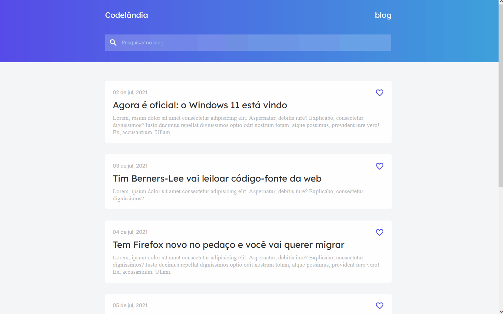

# Codelândia - Desafio 1
[Link do site](https://caducoder.github.io/Codelandia-Desafio1/)

## Sobre
Desafio proposto por @iuricode que consistia em criar um pequeno blog com notícias e animações ao rolar a tela.

## Tecnologias Utilizadas
- HTML5
- CSS3
- ScrollReveal
